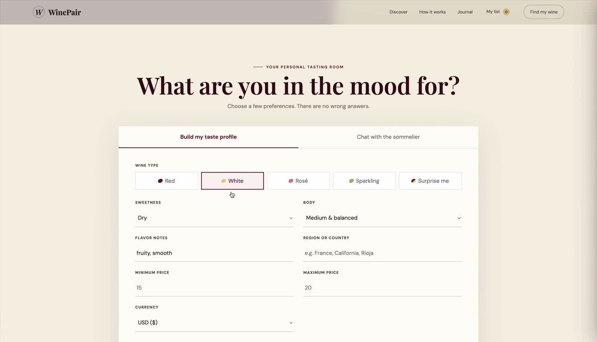

# 🍷 WinePair AI

WinePair AI is a personalized wine discovery and tasting-journal application powered by Google ADK, Gemini, FastAPI, and a deterministic recommendation engine. It helps users discover wines, chat with a virtual sommelier, save bottles, and build a record of their personal taste.

## Demo

[](docs/demo/demo.mp4)

[▶ Watch the demo](docs/demo/demo.mp4)

## Current Experience

### Personalized Recommendations

- Guided discovery by wine type, sweetness, body, flavor notes, region, and budget
- Content-based ranking using weighted TF-IDF and cosine similarity
- Hard filtering for wine type, geography, and price range
- USD, GBP, and EUR budget support with converted result prices
- Relative match rankings that compare each result with the strongest recommendation
- Individual-bottle recommendations only; cases are excluded

### AI Sommelier

- Conversational website chat powered by Google ADK and Gemini
- Natural-language understanding for tastes, regions, prices, currencies, and wine names
- Local recommendation engine used as the source of truth
- Grounded Google Search fallback when a named wine is outside the catalog
- Persistent chat sessions during the active website visit
- Structured recommendation cards that can be saved directly from chat
- In-depth follow-up questions for every suggested wine, grounded in catalog metadata
- Sommelier explanations for flavor, grapes, food pairing, serving, and wine style

### Personal Wine List

- Save recommendations to a private **Want to Try** list
- Add wines from guided results or sommelier chat
- Remove saved wines at any time
- Browser-based persistence between visits
- Slide-out cellar view with saved-wine count

### Tasting Journal

- Dedicated journal page at `/journal`
- Record a wine, tasting date, star rating, and written notes
- Quick-select attributes for sweetness, body, texture, flavors, and overall impressions
- Attribute choices such as dry, too sweet, smooth, tannic, oaky, fruity, and would buy again
- Move saved wines into the journal after tasting them
- Filter past notes by rating
- Track total wines tried and average rating
- Journal entries remain private in the user's browser

### API and Reliability

- Validated FastAPI endpoints for preferences, wine titles, chat, and health checks
- Configurable per-client API rate limiting
- Controlled CORS configuration
- JSON-safe recommendation responses
- 25 automated tests covering recommendation behavior, pricing, APIs, chat, and tool handoffs

## Architecture

```text
Website / ADK Web
       │
       ▼
Google ADK Manager + Gemini
       │
       ▼
FastAPI Recommendation API
       │
       ├── Weighted TF-IDF + cosine similarity
       ├── Type, region, price, and product filters
       └── Grounded search fallback for unknown wines
```

The language model interprets user intent and presents results conversationally. Wine selection remains grounded in tool output from the recommendation API rather than being invented by the model.

## Technology

| Component | Technology |
|---|---|
| Agent orchestration | Google ADK |
| Language model | Gemini 3.6 Flash |
| Backend API | FastAPI + Uvicorn |
| Recommendation engine | pandas, NumPy, scikit-learn |
| Search fallback | Grounded Google Search |
| Frontend | HTML, CSS, JavaScript |
| Local persistence | Browser localStorage |
| Testing | pytest + FastAPI TestClient |

## Setup

### 1. Create a virtual environment

```bash
python3 -m venv venv
source venv/bin/activate
```

### 2. Install dependencies

```bash
pip install -r requirements.txt
```

### 3. Configure the environment

Create a `.env` file in the project root:

```env
GOOGLE_API_KEY=your_api_key_here
API_RATE_LIMIT_PER_MINUTE=60
```

### 4. Start the application

```bash
uvicorn main:app --host 127.0.0.1 --port 8000
```

Open:

- WinePair website: `http://127.0.0.1:8000`
- Tasting journal: `http://127.0.0.1:8000/journal`
- API documentation: `http://127.0.0.1:8000/docs`

### 5. Start Google ADK Web

```bash
adk web --port 8001 .
```

Open `http://127.0.0.1:8001` and select the `manager` app to inspect agent events, tool calls, and traces.

## API Endpoints

| Method | Endpoint | Purpose |
|---|---|---|
| `GET` | `/health` | Service and catalog status |
| `POST` | `/recommend/preferences` | Preference-based recommendations |
| `POST` | `/recommend/title` | Similar wines and external-wine fallback |
| `POST` | `/chat` | Website sommelier conversation |
| `GET` | `/journal` | Full tasting-journal interface |

## Testing

```bash
python -m pytest -q
```

## Future Outlook

WinePair could evolve into a two-sided tasting platform for customers and wineries.

### Customer Experience

- Secure user accounts with portable taste profiles
- Private customer IDs that summarize preferences without exposing unnecessary personal data
- Winery and tasting-session check-in
- Customer-controlled sharing of preferences, dislikes, budget, and selected tasting history
- Recommendations that improve across winery visits

### Winery Experience

- Business dashboard for tasting menus and active sessions
- Temporary access to checked-in customer taste summaries
- Staff-assisted recommendations based on customer preferences and available wines
- Shared tasting notes and staff explanations
- Anonymous tasting-room trends and preference analytics

### WinePair Nearby

A future **WinePair Nearby** experience could provide AirPlay-style tasting discovery without requiring QR codes. Nearby winery sessions could appear automatically using Bluetooth Low Energy, local Wi-Fi discovery, or location proximity. Customers would tap a winery, approve profile sharing, and receive recommendations from the winery's current tasting menu.

For browser compatibility, an initial version could use nearby venue selection with a short confirmation code. A native mobile application could later provide true Bluetooth and local-network discovery. Every check-in would require customer approval, expose only selected profile details, and expire automatically after the tasting session.

### Required Platform Changes

This future direction would require:

- User and winery authentication
- A persistent database instead of browser-only storage
- Customer-controlled privacy permissions
- Winery inventory and tasting-menu management
- Temporary check-in sessions with automatic expiration
- Native mobile support for Bluetooth or local-network discovery
