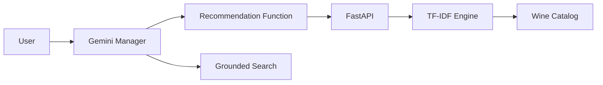

# WinePair AI — Presentation Guide and Talk Track

## Suggested Presentation Length

- Short version: 7–10 minutes.
- Full version: 12–15 minutes.
- Demo: 2–3 additional minutes.

## Slide 1 — Title

**On slide**

> WinePair AI  
> A grounded conversational wine recommendation system

**Talk track**

“WinePair AI helps users discover wines through natural conversation. Instead of forcing users to understand database filters, the system lets them describe what they enjoy and translates that into reliable recommendations from a real catalog.”

## Slide 2 — The Problem

**On slide**

- Wine terminology is intimidating.
- Traditional filters require domain knowledge.
- Generic chatbots can hallucinate products and prices.
- Users may mention wines outside the catalog.

**Talk track**

“The challenge is not only ranking wine. It is interpreting informal preferences while keeping factual details accurate. A pure chatbot is flexible but unreliable, while a traditional recommender is accurate but difficult to use.”

## Slide 3 — The Solution

**On slide**

- Gemini understands user intent.
- FastAPI provides a validated service boundary.
- TF-IDF ranks real catalog wines.
- Google Search handles unknown wines.
- The manager explains results conversationally.

**Talk track**

“The solution combines the strengths of AI and deterministic software. Gemini handles language, but the recommender—not the model—chooses local wines.”

## Slide 4 — Architecture



**Talk track**

“The manager has two tools. The first calls the local recommender. The second performs grounded search only when the wine is missing. This keeps the main request path fast and reduces unnecessary external calls.”

## Slide 5 — The Dataset

**On slide**

- 1,290 wines.
- 17 attributes.
- 25 countries.
- 94 regions.
- Red, white, rosé, orange, tawny, and mixed wines.

**Talk track**

“The catalog is large enough to demonstrate meaningful similarity while still being small enough for fast local vectorization. Missing values are handled explicitly rather than breaking serialization.”

## Slide 6 — Recommendation Algorithm

**On slide**

1. Combine descriptive wine fields.
2. Weight flavor characteristics most heavily.
3. Convert text into TF-IDF vectors.
4. Apply explicit type and region filters.
5. Rank candidates using cosine similarity.

**Talk track**

“TF-IDF is explainable and inexpensive. Characteristics receive the strongest weight because they most directly describe taste and aroma. Hard filters guarantee that an explicit request such as ‘French red’ is honored.”

## Slide 7 — Why Not Let the LLM Recommend Everything?

**On slide**

| LLM-only | Hybrid design |
|---|---|
| May invent wines | Uses catalog titles |
| May invent prices | Uses stored prices |
| Difficult to test | Deterministic ranking |
| Flexible language | Flexible language plus reliable data |

**Talk track**

“The most important design choice was separating conversation from recommendation. Gemini interprets and explains; the engine ranks. This makes the system safer and easier to validate.”

## Slide 8 — Unknown-Wine Search

**On slide**

```text
Local lookup → not found → one grounded search → one broad local recommendation call
```

**Talk track**

“If the wine is missing, the system preserves a structured not-found signal. The manager searches once for metadata, then uses broad type and country information to find local alternatives. Search is limited to control cost and latency.”

## Slide 9 — Performance Design Evolution

**On slide**

- Original: Manager → Sommelier Agent → Manager.
- Problem: prompt-cache misses and extra model calls.
- Improved: Manager → direct recommendation function.
- Original search test: 24 events.
- Improved search test: approximately 6 events.

**Talk track**

“The first implementation was more agent-heavy. Testing showed that each transfer changed system instructions and increased latency. Replacing common agent hops with direct tools made the architecture simpler and faster.”

## Slide 10 — API and Reliability

**On slide**

- Pydantic validation.
- Controlled CORS.
- Health endpoint.
- Request timeout.
- Configurable per-client API rate limit.
- JSON-safe missing values.
- Structured 400 and 404 responses.

**Talk track**

“The API is not only a wrapper. It is the contract between AI orchestration and deterministic logic. Validation and structured errors make tool behavior predictable.”

## Slide 11 — Testing

**On slide**

- 13 automated tests passing.
- Algorithm tests.
- API tests.
- Validation tests.
- Unknown-wine handoff test.
- Country alias and filtering tests.

**Talk track**

“The tests focus on the highest-risk boundaries: honoring explicit constraints, handling missing data, excluding rated wines, returning valid JSON, and preserving the unknown-wine signal.”

## Slide 12 — Live Demo

### Demo 1: Preferences

```text
Recommend five dry, bold, spicy red wines from France.
```

Expected demonstration points:

- One recommendation function call.
- Five French red results.
- No performance warning on the standard path.

### Demo 2: Known Wine

```text
I like The Guv'nor. Recommend similar wines.
```

Expected demonstration points:

- Title lookup.
- Source wine excluded.
- Similar catalog wines returned.

### Demo 3: Unknown Wine

```text
I like Screaming Eagle Cabernet Sauvignon 2019. Find information about it and recommend similar wines.
```

Expected demonstration points:

- Local 404/not-found signal.
- One grounded search.
- External metadata plus local alternatives.

## Slide 13 — Limitations

**On slide**

- Static prices and inventory.
- TF-IDF has limited synonym understanding.
- No persistent user accounts.
- External data varies by source and vintage.
- Partial title matching can be ambiguous.

**Talk track**

“The system is intentionally transparent about its current limits. These limitations directly inform the next development phase.”

## Slide 14 — Roadmap

**On slide**

### Next

- Fuzzy title matching.
- Ratings API endpoint.
- Structured logging and metrics.
- Search caching.

### Later

- Hybrid embedding reranker.
- User profiles and favorites.
- Live inventory and pricing.
- Feedback-driven ranking.

**Talk track**

“The next milestone is personalization and evaluation. The long-term opportunity is connecting recommendations to live inventory and learning from feedback.”

## Slide 15 — Closing

**On slide**

> Flexible conversation.  
> Deterministic ranking.  
> Grounded fallback.

**Talk track**

“WinePair AI demonstrates a practical pattern for AI applications: let the model understand and communicate, but let deterministic tools own factual decisions.”

## Likely Questions and Answers

### Why TF-IDF instead of embeddings?

TF-IDF is fast, local, explainable, and cost-free for a catalog of this size. Embeddings are a logical future reranking layer when semantic synonym handling becomes more important.

### How do you prevent hallucinations?

The manager is instructed to use tool results as the source of truth. Local titles, prices, regions, and styles come from the dataset. Unknown-wine facts come from grounded search.

### Why Google ADK?

ADK provides agent/tool orchestration, sessions, tracing, a development UI, and native Gemini integrations.

### Why did you remove most sub-agent transfers?

Testing showed that direct function tools were faster and produced fewer prompt-cache misses for deterministic work. Separate agents remain useful only where independent reasoning is necessary.

### How is recommendation quality evaluated?

Current tests verify constraints and expected behavior. A future evaluation set should add labeled relevance judgments and metrics such as precision@5, recall@5, and user feedback.

### Can the project scale?

The current matrix is loaded into memory and is appropriate for this dataset. Larger catalogs could use persisted sparse matrices, approximate nearest-neighbor search, caching, and asynchronous service boundaries.

## Final Presentation Checklist

- Start both local services before presenting.
- Confirm the API key is loaded.
- Open the manager app in ADK Web.
- Start a clean session for each demo.
- Keep one backup screenshot or recorded response.
- Run `python -m pytest -q` before the presentation.
- Avoid claiming external prices are real-time guarantees.
