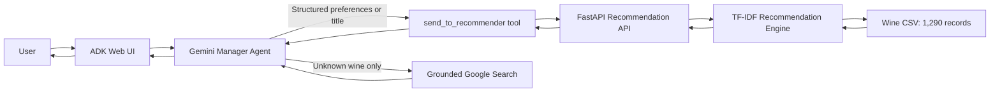
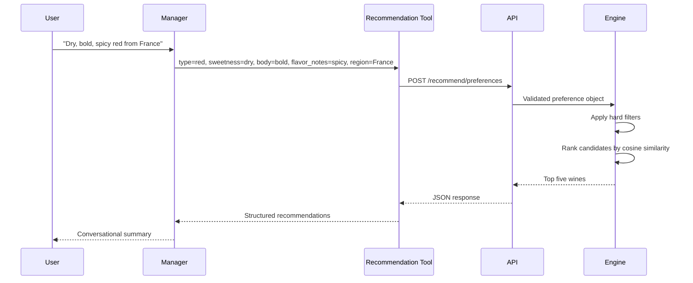

# WinePair AI — Complete Project Guide

## 1. Executive Summary

WinePair AI is a conversational wine recommendation system that combines:

- A deterministic content-based recommendation engine.
- A validated FastAPI service.
- A Gemini-powered conversational manager built with Google ADK.
- Grounded Google Search for wines missing from the local dataset.

The key design principle is separation of responsibilities. Gemini interprets intent and explains results, while the recommendation engine remains the source of truth for ranked local wines. This reduces hallucination risk and makes the recommendation logic testable independently from the language model.

## 2. Problem Statement

Wine discovery is difficult because users often describe preferences informally:

- “I want a bold, spicy French red.”
- “I like The Guv'nor. What is similar?”
- “Tell me about Screaming Eagle and suggest alternatives.”

Traditional filters require users to understand wine terminology and database fields. WinePair AI translates conversational requests into structured preferences, searches a local catalog, and returns a friendly explanation.

## 3. Current Capabilities

- Recommend wines from type, sweetness, body, flavor notes, and region.
- Recommend wines similar to a known title.
- Build a preference profile from positively and negatively rated wines.
- Enforce explicit wine-type and geographic filters.
- Search the web once when a wine is absent from the local catalog.
- Use external wine metadata to request broader local alternatives.
- Validate API input and produce JSON-safe output.
- Run locally through Google ADK Web.

## 4. System Architecture



### Main Components

| Component | Responsibility | Primary file |
|---|---|---|
| Manager agent | Understand intent, call tools, format the final answer | `manager/agent.py` |
| Recommendation tool | Translate agent tool calls into HTTP requests | `manager/sub_agents/sommelier_agent/agent.py` |
| Search tool | Ground missing-wine metadata using Google Search | Configured in `manager/agent.py` |
| API | Validate requests and expose recommendation endpoints | `main.py` |
| Recommender | Rank wines using TF-IDF and cosine similarity | `recommender/recommender.py` |
| Dataset | Store wine metadata | `data/wine_data.csv` |
| Tests | Verify algorithms, API behavior, and tool handoffs | `tests/` |

## 5. Request Flows

### 5.1 Preference-Based Recommendation



### 5.2 Known-Wine Similarity

1. The manager extracts the wine name.
2. `send_to_recommender` calls `POST /recommend/title`.
3. The engine performs a case-insensitive partial title match.
4. The matched wine’s TF-IDF vector becomes the query vector.
5. The source wine is excluded and the five nearest wines are returned.

### 5.3 Unknown-Wine Search

1. The title endpoint returns `404` with `wine_not_found`.
2. The recommendation tool preserves that signal for the manager.
3. The manager performs one grounded Google Search.
4. Gemini summarizes grape, region, style, characteristics, and price.
5. The manager performs at most one broader local recommendation call.
6. The final answer clearly combines external facts with local alternatives.

## 6. Recommendation Methodology

### 6.1 Feature Construction

Each wine is converted into a weighted text document:

| Field | Weight | Reason |
|---|---:|---|
| Characteristics | 5 | Most directly represents flavor and aroma |
| Type | 3 | Strong categorical preference |
| Grape | 3 | Strong indicator of structure and flavor |
| Style | 2 | Captures broad experience such as “Bold & Spicy” |
| Region | 2 | Captures geographic preference and terroir |
| Description | 1 | Rich context but often verbose |
| Country | 1 | Useful geographic context |

Repeated weighted fields are separated by spaces so TF-IDF recognizes the intended terms.

### 6.2 TF-IDF

TF-IDF assigns higher weight to terms that are important to a wine but not common across every wine.

Conceptually:

```text
TF-IDF(term, wine) = term frequency × inverse document frequency
```

The vectorizer uses:

- English stop-word removal.
- Unigrams and bigrams.
- Bigrams for phrases such as “bold spicy” and “sauvignon blanc.”

### 6.3 Cosine Similarity

Cosine similarity measures the angle between the user query vector and each wine vector:

```text
similarity(A, B) = (A · B) / (||A|| × ||B||)
```

Higher scores indicate more similar descriptive profiles.

### 6.4 Hard Filters Before Ranking

Explicit type and region requests are treated as constraints, not weak text hints. A request for a French red therefore filters candidates to French red wines before ranking.

Country aliases are normalized, including:

- United States → USA
- US → USA
- UK → United Kingdom

### 6.5 Rating-Based Recommendations

Ratings are centered around neutral:

- Ratings 4–5 form a positive preference profile.
- Rating 3 is neutral.
- Ratings 1–2 form a negative profile.

The final score rewards similarity to liked wines and applies a penalty for similarity to disliked wines. Rated wines are excluded from the result set.

## 7. Dataset Profile

The current CSV contains:

- 1,290 wine records.
- 17 columns.
- 25 countries.
- 94 regions.
- 584 white wines.
- 569 red wines.
- 124 rosé wines.

Important fields include title, description, price, grape, country, characteristics, type, region, style, vintage, and appellation.

### Data Quality Considerations

The dataset contains missing values, especially:

- Secondary grape varieties: 802 missing.
- Appellation: 646 missing.
- Region: 166 missing.
- Style: 78 missing.

The engine fills missing descriptive text with empty strings during vectorization and converts missing response values to JSON `null`.

## 8. API Reference

### `GET /`

Returns a simple service message.

### `GET /health`

Example response:

```json
{
  "status": "ok",
  "wines_loaded": 1290
}
```

### `POST /recommend/preferences`

Request:

```json
{
  "type": "red",
  "sweetness": "dry",
  "body": "bold",
  "flavor_notes": "spicy",
  "region": "France"
}
```

Response:

```json
{
  "recommendations": [
    {
      "Title": "Example Wine",
      "Grape": "Syrah",
      "Country": "France",
      "Region": "Rhône",
      "Style": "Bold & Spicy",
      "Price": "£25.99 per bottle",
      "similarity_score": 0.142
    }
  ]
}
```

An empty preference object returns HTTP `400`.

### `POST /recommend/title`

Request:

```json
{
  "title": "The Guv'nor"
}
```

Unknown titles return HTTP `404` with a structured `wine_not_found` detail.

## 9. Design Decisions and Rationale

### Deterministic Recommender Instead of LLM-Generated Lists

**Decision:** The model never invents local recommendations.

**Why:** Prices, regions, and titles should come from the dataset. A deterministic engine is testable, reproducible, and less likely to hallucinate.

### Direct Function Tool Instead of a Sommelier Agent Transfer

**Decision:** The manager calls `send_to_recommender` directly.

**Why:** Agent-to-agent transfers changed system instructions, caused context-cache misses, added model calls, and increased latency. Direct function routing removed the normal recommendation-path performance warning.

### Direct Grounded Search Instead of a Search Sub-Agent

**Decision:** Google Search is attached directly to the manager.

**Why:** The original search sub-agent produced repeated searches, repeated recommendation retries, and additional prompt-cache misses. Direct search reduced the tested external-wine flow from 24 events to approximately 6.

### One Search Limit

**Decision:** Unknown-wine requests perform no more than one search.

**Why:** This controls latency, API usage, cost, and inconsistent repeated results.

### Hard Filters Plus Semantic Ranking

**Decision:** Type and geography are hard constraints; flavor/style remain similarity features.

**Why:** Users expect explicit constraints to be honored. Semantic ranking alone previously allowed Australian wines in a French-wine request.

### FastAPI and Pydantic

**Decision:** API payloads use typed Pydantic models.

**Why:** Validation belongs at the system boundary. This limits malformed input, trims text, constrains field length, and generates useful API documentation automatically.

### TF-IDF Instead of Embeddings

**Decision:** Use TF-IDF as the first production-quality ranking method.

**Why:** It is fast, local, explainable, inexpensive, and suitable for a 1,290-row catalog. The tradeoff is weaker semantic understanding of synonyms and subtle flavor relationships.

## 10. Reliability and Safety

- The recommender API uses a 10-second client timeout.
- Internal request failures return controlled messages instead of raw exceptions.
- Unknown wines preserve a structured handoff signal.
- CORS defaults to the local ADK interface instead of allowing every origin.
- Shared dataframe state is not mutated during ranking.
- NaN and infinite values are converted before JSON serialization.
- Search output is grounded and tool results are treated as the source of truth.

## 11. Testing Strategy

The project currently has 13 passing automated tests.

Coverage includes:

- Type and country filter enforcement.
- Country alias normalization.
- Empty preference validation.
- Known-title similarity.
- Unknown-title behavior.
- Rating-range validation.
- Exclusion of already rated wines.
- Health endpoint behavior.
- JSON-safe API output.
- API validation and 404 responses.
- Preservation of the unknown-wine signal through the tool layer.

Run tests with:

```bash
python -m pytest -q
```

The current warnings come from dependency deprecations in the FastAPI/ADK test stack, not failed application behavior.

## 12. Local Setup

```bash
python3 -m venv venv
source venv/bin/activate
pip install -r requirements.txt
```

Create `.env`:

```text
GOOGLE_API_KEY=your_key_here
```

Optional configuration:

```text
RECOMMENDER_API_URL=http://127.0.0.1:8000
CORS_ORIGINS=http://127.0.0.1:8001,http://localhost:8001
API_RATE_LIMIT_PER_MINUTE=60
```

The API rate limit is enforced per client in a rolling 60-second window. The default is 60 requests per minute. Limit responses use HTTP `429` and include `Retry-After`, `X-RateLimit-Limit`, and `X-RateLimit-Remaining` headers. The health endpoint is excluded so infrastructure monitoring remains available.

Start the recommendation API:

```bash
uvicorn main:app --host 127.0.0.1 --port 8000
```

Start ADK Web in a second terminal:

```bash
adk web --port 8001 .
```

Open `http://127.0.0.1:8001` and select the `manager` app.

## 13. Project Structure

```text
wine-adk/
├── data/
│   └── wine_data.csv
├── docs/
│   ├── PROJECT_GUIDE.md
│   └── PRESENTATION_GUIDE.md
├── manager/
│   ├── agent.py
│   └── sub_agents/
│       ├── search_agent/
│       └── sommelier_agent/
├── recommender/
│   └── recommender.py
├── tests/
├── main.py
├── README.md
└── requirements.txt
```

The separate search and sommelier agent definitions remain useful as experiments and reference implementations, but the optimized manager path now uses direct tools.

## 14. Limitations

- TF-IDF does not deeply understand synonyms or sensory relationships.
- The dataset is static and prices may become outdated.
- Partial title matching selects the first match when multiple non-exact titles match.
- External prices can vary significantly by vintage, merchant, and market.
- No persistent user profile or authentication is implemented.
- Rating recommendations currently require at least one positive rating.
- Search quality depends on Gemini grounding availability and the user’s API access.

## 15. Recommended Roadmap

### Near Term

1. Add structured logging and request IDs.
2. Add a rating recommendation API endpoint.
3. Add fuzzy title matching with confidence scores.
4. Add evaluation fixtures for expected recommendation relevance.
5. Remove or archive unused experimental agent files.

### Medium Term

1. Add persistent users, favorites, and rating histories.
2. Add price range, food pairing, vintage, and availability filters.
3. Add a hybrid TF-IDF plus embedding reranker.
4. Cache external wine lookups.
5. Add observability for latency, tool count, search count, and failures.

### Long Term

1. Connect live merchant inventory and pricing.
2. Add feedback-driven learning-to-rank.
3. Add image/label recognition.
4. Add personalized explanations based on user history.
5. Deploy the API and UI with authentication, rate limiting, and monitoring.

## 16. Success Metrics

Useful product metrics include:

- Recommendation click-through rate.
- Save/favorite rate.
- User rating after recommendation.
- Percentage of requests resolved from the local catalog.
- Search fallback frequency.
- Median and 95th-percentile response latency.
- Average number of tool calls per request.
- Geographic/type constraint accuracy.
- Search result citation coverage.

## 17. Presentation Summary

The strongest project story is not simply “an AI recommends wine.” It is:

> WinePair AI combines a conversational interface with a deterministic recommendation engine, using grounded search only when the local catalog cannot answer. The architecture keeps language understanding flexible while keeping recommendation data controlled, testable, and explainable.
